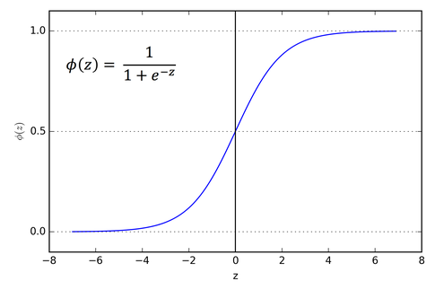

- Types of ML

  1. Supervised Learning - Labeled Inputs, each item is Labeled.
  2. Unsupervised Learning - Unlabled Inputs, where items are classified into groups based on similarities
  3. Reinforcement Learning - Training a model by giving a positive reaction to the model when the predicted output for a given input is correct and and negative reation when the prediction is wrong.

- Features
  a. Qualitative

  1. Nominal Data - Data which can be classified into various group but has not inherent order. eg: Genders, Nationality.
  2. Ordinal Data - Data which can be classified into various group and has inherent order. eg: Stages of Life, Human Moods etc.

  b. Quantitative

  1. Continous - eg: Length, Temperature etc.
  2. Discrete - eg: No. of something

- Types of Outputs (Supervised Learning)
  a. Classification - predict discrete classes

  1. Multiclass Classification - eg: Apple, Orange, Banana etc.
  2. Binary Classification - eg: Apple / Not Apple(Orange, Banana etc.)

  b. Regression - predict continous values eg: price of stocks, house etc.

- Training a Model
  We have a matrix of data which has many feature on the basis of which we predict a class.
  Each row is a sample of data and each column is a unique feature and the last column is the class.
  Feature Vector - One row of features of sample of data.
  Target - Output of the Feature Vector.
  Feature Matrix (X) - The matrix of all the features.
  Labels/targes vector (Y) - The matrix of all the outputs

- Dividing the Dataset.
  We divide the dataset into 3 sets i.e. The Training Dataset, The Validation Dataset & The Testing Dataset

- Loss
  It is the difference between the prediciton of the model and the Label / actual value.

- Loss Function

  1. L1 Loss = Σ |y_real - y_predicted|
  2. L2 Loss = Σ (|y_real - y_predicted|)^2
  3. Binary Corss-Entropy Loss

- Accuracy
  Percentage of correct predictions out of all the predictions.

- Steps to Training a Model
  We feed the model a Feature Vector and then compare the models output to the corresponding Target.
  Training - Modifing the model to minimize the difference between the models output and the actual target is the porcess of training the model.

  We feed the entire training data set into the model and then compare the predictions with the targets the diffierence in value is known as the Loss. Accordingly we make adjustments i.e. training.

  After many such iterations we feed the model the validation set, but this time the loss is not used for further training the model.

  Next we compare the Losses of all the models in hand and chosse the model with the lowest loss and feed it the Test Set and this gives us the Final Reported Performance

- Various Models

  1. K-Nearest Neighbours
     K is an odd number
     We plot a graph with all the features as the axis, and the points that form on the graph are the labels
     To predict what the label of a collection of features might be we observer the k closest labels and decide that label based on the majority.

      For K = 1
                   precision    recall  f1-score   support

           0       0.76      0.67      0.71      1362
           1       0.83      0.88      0.85      2442

    accuracy                           0.80      3804
   macro avg       0.79      0.78      0.78      3804
weighted avg       0.80      0.80      0.80      3804

      For K = 3
                  precision    recall  f1-score   support

           0       0.72      0.73      0.73      1334
           1       0.86      0.85      0.85      2470

    accuracy                           0.81      3804
   macro avg       0.79      0.79      0.79      3804
weighted avg       0.81      0.81      0.81      3804

      For K = 5
                  precision    recall  f1-score   support

           0       0.74      0.74      0.74      1341
           1       0.86      0.85      0.86      2463

    accuracy                           0.82      3804
   macro avg       0.80      0.80      0.80      3804
weighted avg       0.82      0.82      0.82      3804

  2. Naive Bayes

                  precision    recall  f1-score   support

           0       0.72      0.40      0.52      1374
           1       0.73      0.91      0.81      2430

    accuracy                           0.73      3804
   macro avg       0.73      0.66      0.66      3804
weighted avg       0.73      0.73      0.71      3804

  3. Logistic Regression
    We have a plot with the label (1/0) on the Y-axis and a single feature on the X-axis
                precision    recall  f1-score   support

           0       0.70      0.72      0.71      1336
           1       0.85      0.83      0.84      2468

    accuracy                           0.79      3804
   macro avg       0.77      0.78      0.77      3804
weighted avg       0.79      0.79      0.79      3804

  4. Support Vector Mechine (SVM) 
    We have a plot with features on the X and Y axis, we draw a line which divides the labels equally. We draw a line along the labels close to the dividing line and these are known as margins and the labels are know as support vecotrs

                  precision    recall  f1-score   support

           0       0.79      0.81      0.80      1318
           1       0.90      0.89      0.89      2486

    accuracy                           0.86      3804
   macro avg       0.85      0.85      0.85      3804
weighted avg       0.86      0.86      0.86      3804

  5. Neural Networks
    There are multiple layers in a Neural net, each layer is known as a Neuron.
    We have an input where all of the features are inputed. All the inputs are weighted by a number which is special for each feature that means a feauture say x1 is multiplied by a weight x1 and so on. These weighted features are then added to form a Neuron, to which we add a bias term, which gives us an activation function.
    Without an activation function, our neural net just becomes a linear model. Egs. of an activation function are: 
    1. The sigmoid function 
      
    
    2. tanh Function
      
    
    3. RELU
      

    These are non-linear functions. These functions basically makes our network non-linear i.e. we cannot backtrack the function to get the original input.

  6. Linear Regression
      We plot our features as the axis and draw a line, plane and so on based on the number of axis, which best fits our data.
      
      residual/error: The distance between the actual value and the prediction
      
      To get the best fit line, we try to minimize the sum of the residuals
      
      Simple Linear Regression: y = a + bx
      Multiple Linear Regression: y = a + b_1x_1 + b_2x_2 + ........... b_nx_n

      Assumptions:
        1. Linearity - The data follows a linear pattern
        2. Independence - All the points are independent from each other and have no inffluence on one another.
        3. Normality - If we plot a graph for the Residuals, then they should follow a normal distribution.
        4. Homoskedasticity - In simple terms, the points should be spread apart evenly.

      Evaluation:
      1. Mean Absolute Error (MAE)
        It gives us the accuracy of our model.
        MAE = Sum of Residual / No. of Data points

      2. Mean Squared Error (MSE)
        MSE = Sum of Residual^2 / No. of Data Points

      3. Root Mean Square Error (RMSE)
        RMSE = (Sum of Residual^2 / No. of Data Points)^1/2  

      4. R^2 - Coefficient of Determination
        TSS = Sum of (differences in value and mean value)^2
        R^2 = 1-  (Sum of Residual^2/TSS) 
